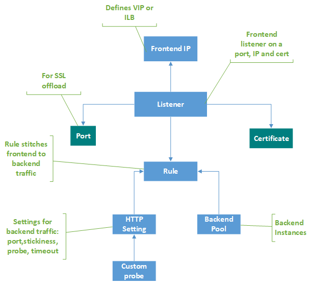
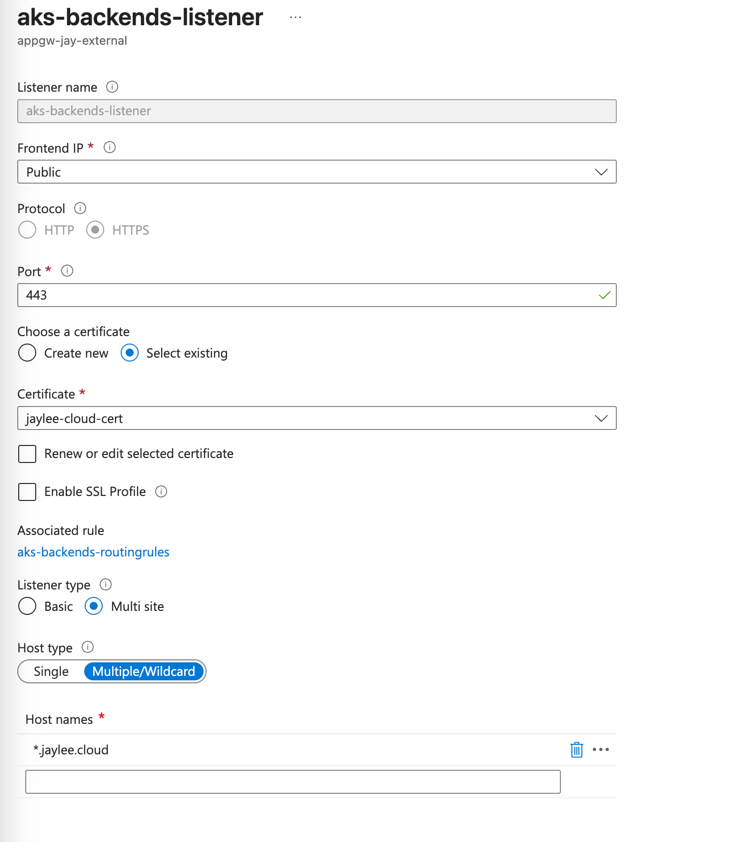
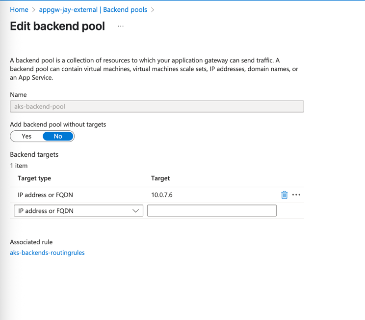
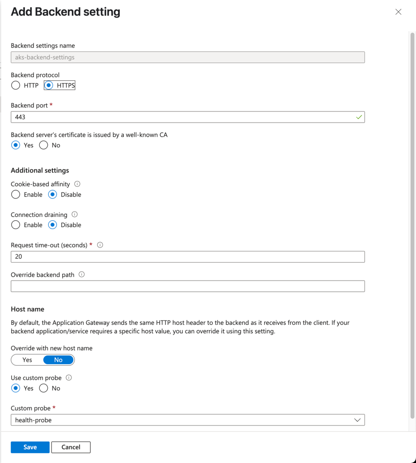
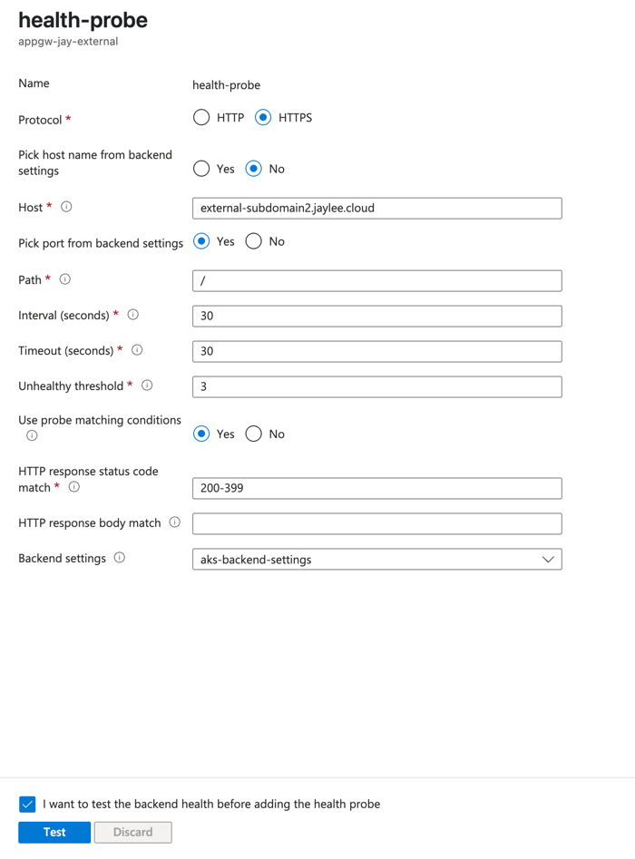
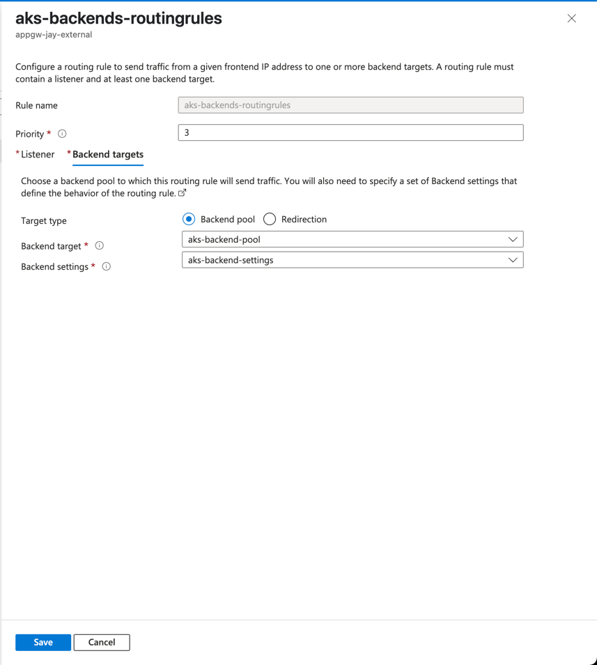
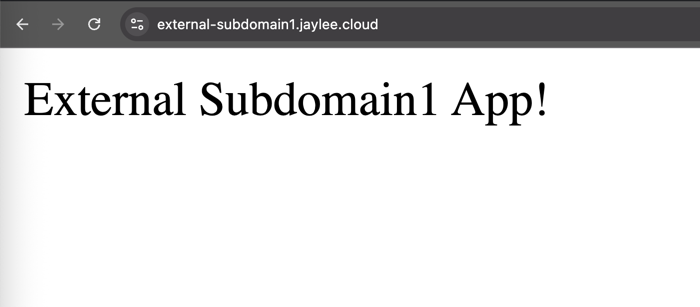

# Configuring Managed Nginx Ingress Controller with Azure Application Gateway

This document provides a guide on how to configure a Managed Nginx Ingress Controller with Azure Application Gateway in an Azure Kubernetes Service (AKS) cluster. The setup includes using Azure Key Vault for TLS certificates and configuring the ingress resources.
In the example, I assume that you have two subdomains, `external-subdomain1.jaylee.cloud` and `external-subdomain2.jaylee.cloud`, which will be used to route traffic to two different applications running in the AKS cluster. Certificates for these subdomains are stored in Azure Key Vault, and the ingress controller is configured to use these certificates for TLS termination.

## Enable Managed Nginx Ingress Controller

[Advanced NGINX ingress controller and ingress configurations with the application routing add-on](https://learn.microsoft.com/en-us/azure/aks/app-routing-nginx-configuration?tabs=azurecli).

Make sure to control the default NGINX ingress controller not to have public IP by setting `DefaultIngressControllerType` as below. 

```bash
az aks approuting update --resource-group <ResourceGroupName> --name <ClusterName> --nginx Internal

```

## Ingress 

Be aware that `kubernetes.azure.com/tls-cert-keyvault-uri` annotation creates a secret in the cluster with the name `keyvault-<ingress-name>`.

```yaml
apiVersion: networking.k8s.io/v1
kind: Ingress
metadata:
  annotations:
    kubernetes.azure.com/tls-cert-keyvault-uri: https://kv-jay-eastus.vault.azure.net/certificates/aks-ingress-jaylee-cloud-cert
  name: external-app1
spec:
  ingressClassName: nginx-internal
  rules:
    - host: external-subdomain1.jaylee.cloud
      http:
        paths:
          - backend:
              service:
                name: external-app1
                port:
                  number: 80
            path: /
            pathType: Prefix
  tls:
    - hosts:
        - external-subdomain1.jaylee.cloud
      secretName: keyvault-external-app1
```

## Application Gateway 

Have a look at the Application Gateway components in the diagram below. There are numerous components to be configured to make App Gateway work, and diagram will guide you through the process whenever you're lost. 

This will help you understand how the Application Gateway 



### Listener

The listener is the entry point for the Application Gateway. It listens for incoming traffic on a specific port and forwards it to the appropriate backend pool based on the rules defined.



### Backend Pool

Here, backend pool is set to the private IP of the NGINX Ingress Controller. 



### Backend Settings



### Custom Health Probe

As we use wildcard host type in the Listener, we need to set a custom health probe to check the health of the NGINX Ingress Controller.
Ideally, you could setup a custom health probe for Nginx ingress controller itself, but in this example, I use one of the ingress of the application. 



### Rules



### Test

