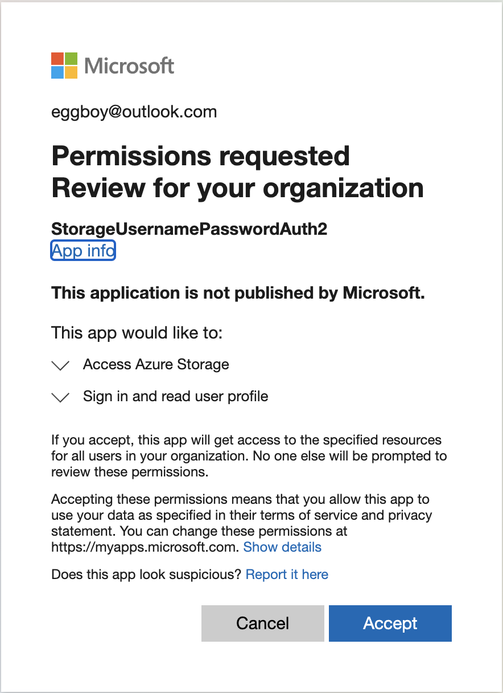

# ROPC Flow

AAD ROPC flow is described at 
https://docs.microsoft.com/en-us/azure/active-directory/develop/v2-oauth-ropc

ROPC uses `UsernamePasswordCredential` with username password. Most importantly *This is not recommended for production environment* 
``
		UsernamePasswordCredential managedIdentityCredential = new UsernamePasswordCredentialBuilder().clientId(clientId)
				.username("").password("").build();
``
Register a new app on AAD.


Allow public client flows of App.


Create an app on AAD, and give permissions as below.


After permission assignment, you need accept permission request by accessing the url. 

`https://login.microsoftonline.com/[TENANT_ID]/oauth2/authorize?client_id=[CLIENT_ID]&redirect_uri=http://localhost&response_type=code&prompt=admin_consent`

Open this url will redirect to the page like this.


This is it. 

# Managed Identity

Managed Identity uses `ManagedIdentityCredential`. clientId here is client id of Managed Identity.

```
		ManagedIdentityCredential managedIdentityCredential = new ManagedIdentityCredentialBuilder()
		.clientId(clientId)
		.build();
```
Setting up Pod Identity with Managed Identity on AKS is describe at  
https://github.com/eggboy/AKS/tree/main/PodIdentity